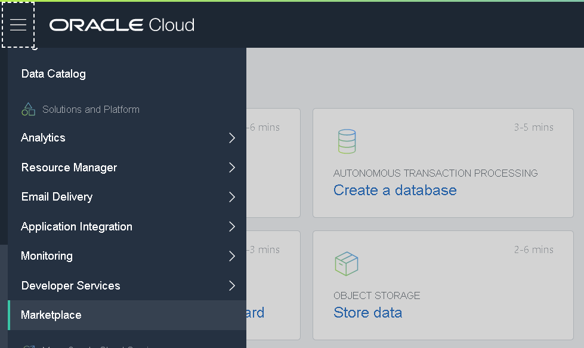
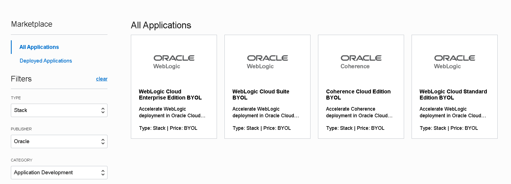
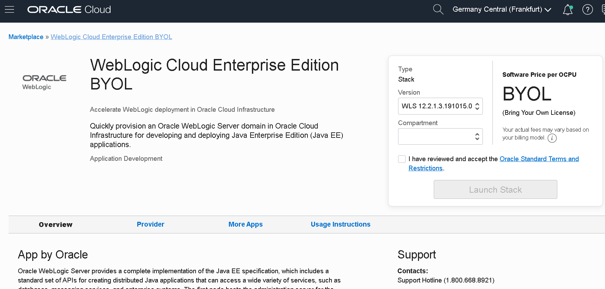
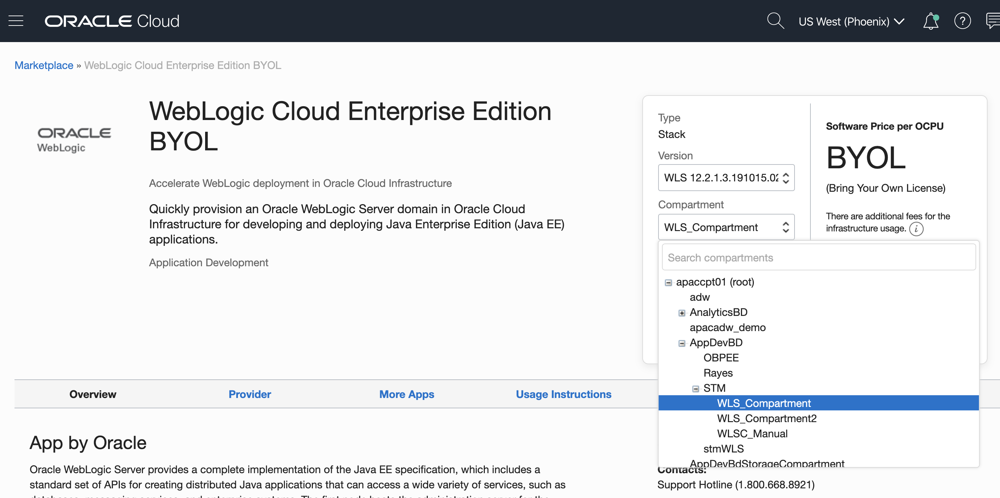
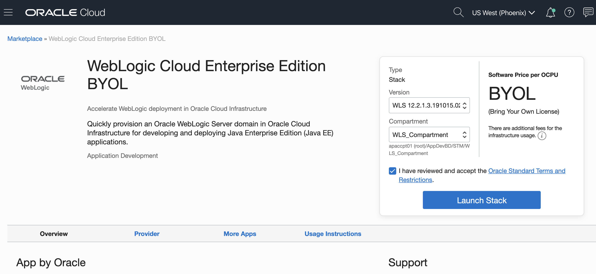

# WebLogic-Cloud-Workshop
Provisioning a Weblogic domain with WebLogic Cloud from OCI Marketplace

# 0. Prerequisites

- [Oracle Cloud Infrastructure](https://cloud.oracle.com/en_US/cloud-infrastructure) enabled account. The tutorial has been tested using [Trial account](https://myservices.us.oraclecloud.com/mycloud/signup) (as of January, 2019).

# 1. Required Keys and OCIDs
Execute the following 3 steps as per [Required Keys and OCIDs](https://docs.cloud.oracle.com/en-us/iaas/Content/API/Concepts/apisigningkey.htm):

1. Create a user in IAM for the person or system who will be calling the API, and put that user in at least one IAM group with any desired permissions. See Adding Users. **You can skip this if the user exists already.**

2. Get these items:

  * RSA key pair in PEM format (minimum 2048 bits).
  * Fingerprint of the public key.
  * Tenancy's OCID and user's OCID.

3. Upload the public key from the key pair in the Console

---

**Note:** Keep a record of: **Fingerptint of the public key**, **Tenancy's OCID**, **user's OCID**, and **Path of the private key on your desktop** for later use in this lab.

---

# 2. Encode the WebLogic administrator password in base64 format

1. Choose a password with the following requirements

2. Encode the password in base64 format

  For example, on Linux:

```
$ echo -n 'Your_Password' | base64
```

---

**Note:** Keep a record of the output of the above **'echo -n 'Your_Password' | base64'** command for later use in this lab.

---

# 3. Create an SSH Key 

Create a secure shell (SSH) key pair so that you can access the compute instances in your Oracle WebLogic Server domains.

A key pair consists of a public key and a corresponding private key. When you create a domain using Oracle WebLogic Cloud, you specify the public key. You then access the compute instances from an SSH client using the private key.

On a UNIX or UNIX-like platform, use the ssh-keygen utility. For example:

```
$ ssh-keygen -b 2048 -t rsa -f mykey
    
$ cat mykey.pub  
```

---

**Note:** Keep a record of the output of the above **'cat mykey.pub'** command for later use in this lab.

---

On a Windows platform, you can use the PuTTY Key Generator utility. See [Creating a Key Pair ](https://www.oracle.com/pls/topic/lookup?ctx=en/cloud/paas/weblogic-cloud/user&id=oci_general_keypair) in the Oracle Cloud Infrastructure documentation.

# 4. Install terraform and terraform OCI provider on your desktop

Download and install terraform and the OCI Terraform Provider as in [Getting Started with the Terraform Provider](https://docs.cloud.oracle.com/en-us/iaas/Content/API/SDKDocs/terraformgetstarted.htm)

# 5. Clone this github on your laptop

Clone the WebLogic Cloud Worshop git repository to your desktop.
```
git clone https://github.com/StephaneMoriceau/WebLogic-Cloud-Workshop.git
```

# 6. Update the terraform configuration file with the specific of your environment

1. Copy the terraform configuration variables example file

```
$ cd ~/WebLogic-Cloud-Workshop/terraform

$ cp terraform.tfvars.example terraform.tfvars
```

2. Open the terraform.tfvars file

Use your preferred editor and open the file terraform.tfvars. it should look like this:

```
# Identity and access parameters

oci_base_identity = {
  api_fingerprint      = "64:8c:3b:..."
  api_private_key_path = "/Path/to/my/private/key/mykey.pem"
  api_private_key_password = "private_key_passphrase"
  compartment_id       = "ocid1.compartment.oc1..aaaaaaaa3l..."
  tenancy_id           = "ocid1.tenancy.oc1..aaaaaaaaznlqfv..."
  user_id              = "ocid1.user.oc1..aaaaaaaajbvljcmjw..."
}

oci_base_general = {
  label_prefix = "base"
  region       = "us-MYREGION-1"
}


# Base 64 password

Base64_Password = "bWlu..."


# Infrastructure parameters (if you change either Compartment_name or Dynamic_Group_name update the statement accordingly in the Create Policy for the Dynamic group in main.tf)

Compartment_name = "WLS_Compartment"
Dynamic_Group_name = "WLS_Dynamic_Group"
Policy_name = "WLS_Policy"
Vault_name = "WLS_Vault"
Key_name = "WLS_Key"
```


3. Update the terraform.tfvars file with the specific of your environment

Update the following variables with the values your recorded earlier in the lab

- api_fingerprint            [(section #1)](https://github.com/StephaneMoriceau/WebLogic-Cloud-Workshop/blob/readme/README.md#1-required-keys-and-ocids)
- api_private_key_path       [(section #1)](https://github.com/StephaneMoriceau/WebLogic-Cloud-Workshop/blob/readme/README.md#1-required-keys-and-ocids)
- api_private_key_password   [(section #1)](https://github.com/StephaneMoriceau/WebLogic-Cloud-Workshop/blob/readme/README.md#1-required-keys-and-ocids) 
- compartment_id             (use the Tenancy OCID as per [section #1](https://github.com/StephaneMoriceau/WebLogic-Cloud-Workshop/blob/readme/README.md#1-required-keys-and-ocids))
- tenancy_id                 [(section #1)](https://github.com/StephaneMoriceau/WebLogic-Cloud-Workshop/blob/readme/README.md#1-required-keys-and-ocids))           
- user_id                    [(section #1)](https://github.com/StephaneMoriceau/WebLogic-Cloud-Workshop/blob/readme/README.md#1-required-keys-and-ocids)

- region (see note below)
---

**Note:** To confirm your home region: Open the Console, open the Region menu, and then click Manage Regions.
A list of the regions offered by Oracle Cloud Infrastructure is displayed. Select your **home region code** e.g. us-ashburn-1, us-phoenix-1.

---

- Base64_Password            [(section #2)](https://github.com/StephaneMoriceau/WebLogic-Cloud-Workshop/blob/readme/README.md#2-encode-the-weblogic-administrator-password-in-base64-format)

4. Save terraform.tfvars


# 7. Create the required infrasture to provision a Domain in WebLogic Cloud from the OCI Marketplace

1. Initialize Terraform:

```
$ terraform init
```

2. View what Terraform plans do before actually doing it:

```
$ terraform plan
```

3. Use Terraform to Provision resources:

```
$ terraform apply
```

The result has to be similar:

```
oci_kms_key.WLS_Key: Still creating... [1m10s elapsed]
oci_kms_key.WLS_Key: Still creating... [1m20s elapsed]
oci_kms_key.WLS_Key: Still creating... [1m30s elapsed]
oci_kms_key.WLS_Key: Creation complete after 1m39s [id=ocid1.key.oc1.phx.a5pc75peaafqw.abyhqljrhfywkf5hkv0000000000u2km2f4
oci_kms_encrypted_data.WLS_Encrypted_Data: Creating...
oci_kms_encrypted_data.WLS_Encrypted_Data: Creation complete after 2s [id=]

Apply complete! Resources: 3 added, 0 changed, 2 destroyed.

Outputs:

Encrypted_data = IcsoJqtmCj5IAPgzF+WYqQj7arZDn8Cq0MDX6mm7ChK3000000000000WJcMcUgAAAAA=
compartment_id = ocid1.compartment.oc1..aaaaaaaayamtcvxtx32y3ex3000000000000000hlybyag3ibeza
cryptographic_endpoint = https://a500000000000w-crypto.kms.us-phoenix-1.oraclecloud.com
key_OCID = ocid1.key.oc1.phx.a5pc75peaafqw.abyhqljrhfywkf5hkvazr75dmu20000000000f5tskaozewo6kea
```

---

**Note:** Keep a record ofof the output of the above **Encrypted_data**, **cryptographic_endpoint**, and **key_OCI** for later use in this lab.

---


# 8. Provision a Domain in WebLogic Cloud from the OCI Markeplace

**Launch a Stack**

Sign in to Marketplace and specify initial stack information.

1. Sign in to the Oracle Cloud Infrastructure Console.

2. Click the  Navigation Menu icon and select Marketplace.



3. You can choose to browser-search for WebLogic Cloud, or for faster search you can apply the filters:

Type: Stack
Publisher: Oracle
Category: Application Development



3. Choose **WebLogic Cloud Enterprise Edition BYOL**; This brings you to the Stack Overview page:



4. Select a version of Oracle WebLogic Server 12c.
If there's more than one 12c patch, the latest patch is the default.

5. Select the compartment **"WLS_Compartment"** in which we will create the stack.



By default the stack compartment is used to contain the domain compute instances and network resources. If later on you specify a network compartment on the Configure Variables page of the Create Stack wizard, then only the compute instances are created in the stack compartment that you select here.

6. Select the Terms and Restrictions check box, and then click Launch Stack.



The Create Stack wizard is displayed.


**Specify Stack Information**

Specify the name, description, and tags for the stack.

1. On the Stack Information page of the Create Stack wizard, enter a name for your stack.

2. Enter a description for the stack (optional).

3. Specify one or more tags for your stack (optional).

4. Click Next.

The Configure Variables page opens.

**Configure WebLogic Instance Parameters**

Specify the parameters needed to configure the WebLogic instance domain.

1. In the WebLogic Server Instance section, enter the resource name prefix.
The maximum character length is 8.
This prefix is used by all the created resources.

2. Select the WebLogic Server shape for the compute instances.
Only the following shapes are supported: VM.Standard2.x, VM.Standard.E2.x, BM.Standard2.x, BM.Standard.E2.x

3. Enter the SSH public key.

4. Select the availability domain where you want to create the domain.

5. Select the number of managed servers you want to create. You can specify up to 4 if you're using WebLogic Server 11g Standard Edition. For all other editions and versions, you can specify up to 8 nodes.

The managed servers will be members of a cluster, unless you selected WebLogic Server Standard Edition.

6. Enter a user name for the WebLogic Server administrator.

7. Enter an encrypted password for the WebLogic Server administrator. The password must be encrypted. 

**Configure Advanced Parameters for a Domain**

You can optionally specify additional parameters by selecting WLS Instance Advanced Configuration on the Configure Variables page of the Create Stack wizard.

Select WLS Instance Advanced Configuration if you want to change the default port numbers, or remove the sample application. Cluster-related parameters are not applicable if you selected WebLogic Server Standard Edition.

Configure Network Parameters
Define the Virtual Cloud Network (VCN) and subnet configuration for the basic domain. For this basic domain, the domain instance attaches to a public subnet.

In the WebLogic Server Network section of the Configure Variables page, select the Network Compartment in which to create the network resources for this domain.
If you don't specify a network compartment, then all the network resources and the domain compute instances are created in the stack compartment that you selected earlier upon launching the stack. Select a network compartment if you want the network resources to be in a different compartment than the compute instances.
Select a Virtual Cloud Network (VCN) strategy:
Select Use Existing VCN, and then select the name of the existing VCN.
Select Create New VCN, and then enter a name and CIDR for the new VCN.
Select one of the following subnet strategies:
Select Use Existing Subnet.
Select Create New Subnet.
Note:If you're creating a new VCN, you can only create a new subnet.
Keep the default Use Public Subnet selection.
Select the subnet span:
Regional Subnet. The subnet has resources in a region's multiple availability domains, and is not specific to any one availability domain.
AD Specific Subnet. The subnet is defined in one particular availability domain.
For the WebLogic Server subnet, specify one of the following:
If you want to use an existing regional subnet, then choose the name of an existing regional subnet from the list of regional and availability domain-specific subnets.
If you want to use an existing availability domain-specific subnet, choose the name of an existing availability domain-specific subnet from the list of regional and availability domain-specific subnets.
If you are creating a new regional or availability domain-specific subnet, specify a CIDR for the new subnet.
Configure a Load Balancer
You have the option to create a load balancer to distribute application traffic to the WebLogic Managed Servers.

To create a load balancer:

Select Provision Load Balancer.
Configure the load balancer network.
If you chose to use an existing regional subnet for WebLogic Server, then select an existing regional subnet from the list of regional and availability domain-specific subnets. A load balancer can have only one regional subnet, which is shared between both nodes.
If you chose to create a regional subnet for WebLogic Server, then specify a CIDR for the new load balancer subnet.
If you chose to create availability domain-specific subnets for WebLogic Server, then select an availability domain for the load balancer's first node, and the CIDR for the first subnet, Load Balancer Subnet CIDR. Then select an availability domain for the load balancer's second node, and the CIDR for the second subnet, Load Balancer Subnet 2 CIDR.
Select a load balancer shape. The default is 400 Mbps.
Select Prepare Load Balancer for HTTPS if you want the load balancer to listen on the HTTPS port. You must add your SSL certificate to the load balancer after creating the domain.
Configure WebLogic Authentication
You have the option to use Oracle Identity Cloud Service to authenticate application users for your domain.

This configuration is only available if the domain meets these requirements:

Running WebLogic Server 12c
Includes a load balancer
To use Oracle Identity Cloud Service for authentication:

Select Enable Authentication Using Identity Cloud Service.
Enter your Oracle Identity Cloud Service (IDCS) tenant name, which is also referred to as the instance ID.
This ID is typically found in the URL that you use to access Oracle Identity Cloud Service, and has the format idcs-<GUID>.
Enter the client ID and encrypted client secret of an existing confidential application in this Oracle Identity Cloud Service instance.
The client secret must be encrypted.
If necessary, you can override the default domain name and port that you use to access Oracle Identity Cloud Service, or the default port that is used for the App Gateway software appliance.
Configure Database Parameters
A basic WebLogic Server 12c domain does not require a database.

In the Database section of the Configure Variables page, for Database Strategy, select No Database if you are creating a basic domain.

To create a domain that uses an existing database, see Create a JRF-Enabled Domain. All Oracle WebLogic Server 11g domains include the Java Required Files (JRF) components and require a database.

Specify the Key Management Service Configuration
Specify information that enables Oracle WebLogic Cloud to decrypt the encrypted password for your domain.

In the Key Management Service Key ID field of the Key Management Service Configuration section of the Configure Variables page, enter the OCID of your encryption key.
In the Key Management Service Endpoint field, enter the endpoint URL for the vault that contains your encryption key.
At the bottom of the Configure Variables page, click Next.
You are now ready to create the stack.
Configure Tags
Oracle WebLogic Cloud can optionally assign tags to the resources (compute, network, and so on) that it creates for your domain.

Tagging allows you to define keys and values and associate them with resources. You can then use the tags to help you organize and find resources based on your business needs. There are separate fields to tag the stack and to tag the resources created within the stack.

To assign an existing tag, enter the Defined Tag Key and Defined Tag Value.
Specify the name of a defined tag using the format <namespace>.<key>. For example, Operations.CostCenter.
To assign a free-form tag, enter the Free-Form Tag Key and Free-Form Tag Value.
Free-form tag keys and values are case sensitive. For example, costcenter and CostCenter are treated as different tags.
Create the Domain Stack
After you have specified the WebLogic instance variables, finish creating the domain stack.

On the Review page of the Create Stack wizard, review the information you have provided, and then click Create.

The Job Details page of the stack in Resource Manager is displayed. A stack creation job name has the format ormjobyyyymmddnnnnnn. (for example, ormjob20190919165004). Periodically monitor the progress of the job until it is finished. If an email address is associated with your user profile, you will receive an email notification.
Note:If you run an Apply job on an existing stack that you created with Oracle WebLogic Cloud, all resources in the stack will be deleted and recreated.
Use Your New Domain
Access and manage your new domain after creating a stack with Oracle WebLogic Cloud.

Typical tasks that you might perform after creating a domain:
View and manage the cloud resources that were created to support your domain. See View the Cloud Resources for a Domain.
Use the WebLogic Server administration console to configure your domain. Create data sources, JMS modules, Coherence clusters, and so on, or deploy applications. See Access the WebLogic Console.
Access the sample application that's deployed to your domain. See Access the Sample Application.
Secure access to your applications using Oracle Identity Cloud Service. See Secure a Domain Using Identity Cloud Service.
If you selected the HTTPS option for the load balancer, you must add your SSL certificate to the load balancer. See Configure SSL for a Domain.
Troubleshoot a problem with your new stack. See Stack Creation Failed.
